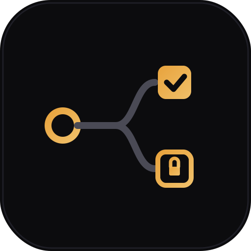
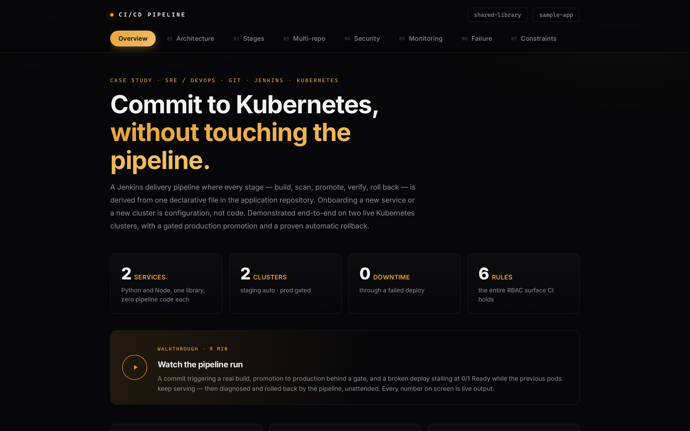
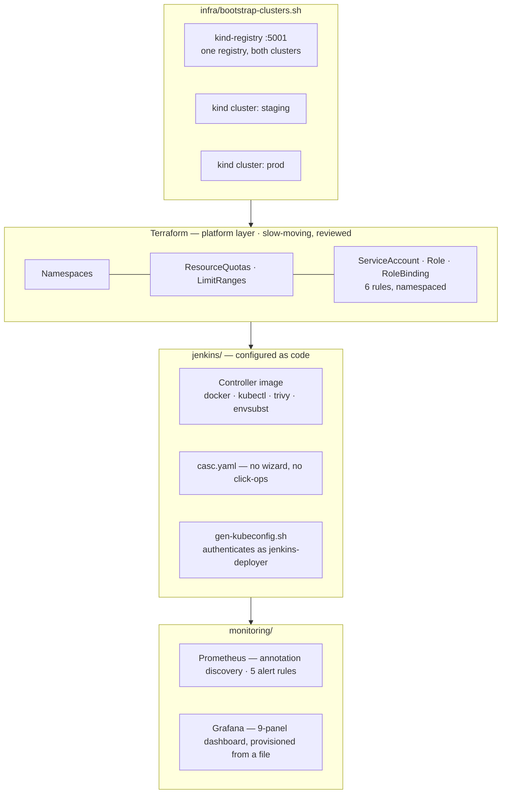

<div align="center">



# CI/CD Pipeline — Platform

### The ground the pipeline runs on. Two Kubernetes clusters, a Jenkins controller configured as code, least-privilege RBAC in Terraform, and a monitoring stack — **all reproducible from this repository.**

[](LICENSE)
[](#terraform--the-platform-layer)
[](#what-it-builds)
[](#least-privilege-as-code)
[](#monitoring)
[](#monitoring)
[](#documentation)

[](#terraform--the-platform-layer)
[](#what-it-builds)
[](#jenkins-as-code)
[](#what-it-builds)
[](#monitoring)
[](#monitoring)
[](#cloud-portability)
[](#jenkins-as-code)

<br/>

<video src="https://github.com/user-attachments/assets/23697115-85e6-41ca-96bd-2b451eb72274" width="820" controls muted></video>

<sub><b>60 seconds:</b> a broken deploy stalls at <code>0/1</code> Ready while the previous pods keep serving — then the pipeline diagnoses it and rolls back, unattended. Full 9-minute walkthrough below.</sub>

[](https://youtu.be/8HLydMg_BCg)

⚙️ **[Shared Library](https://github.com/ayushgupta07xx/cicd-pipeline-shared-library)** · 🐍 **[Sample App](https://github.com/ayushgupta07xx/cicd-pipeline-sample-app)** · 🟩 **[Orders API](https://github.com/ayushgupta07xx/cicd-pipeline-orders-api)** · 📄 **[Docs](docs/)**

</div>

---

## The case study

A walkthrough of the design, the evidence behind every claim, and a constraints
section naming what this setup compromises and what production would do instead.

[](https://ayushgupta07xx.github.io/cicd-pipeline-sample-app/)

<div align="center">

**[→ Read the case study](https://ayushgupta07xx.github.io/cicd-pipeline-sample-app/)** ·
[Architecture](https://ayushgupta07xx.github.io/cicd-pipeline-sample-app/#architecture) ·
[Multi-repo](https://ayushgupta07xx.github.io/cicd-pipeline-sample-app/#multirepo) ·
[Security](https://ayushgupta07xx.github.io/cicd-pipeline-sample-app/#security) ·
[Failure handling](https://ayushgupta07xx.github.io/cicd-pipeline-sample-app/#failure) ·
[Constraints](https://ayushgupta07xx.github.io/cicd-pipeline-sample-app/#constraints)

</div>


Application code lives elsewhere. **This repository builds the ground it runs on** — and it exists because an SRE submission whose environment is reproducible only on one laptop has failed at the thing it claims to be about.

`./infra/bootstrap-clusters.sh` → `terraform apply` → `./jenkins/run-jenkins.sh` → the monitoring manifests. That's a working platform from an empty machine.

## What it builds



| Directory | Contents |
|---|---|
| `infra/` | `bootstrap-clusters.sh` — the kind clusters and the shared registry, idempotent |
| `terraform/` | Platform layer: namespaces, quotas, limit ranges, least-privilege RBAC. Plus a validated GKE module |
| `jenkins/` | Controller image, plugin manifest, JCasC config, job definitions, kubeconfig minting |
| `monitoring/` | Prometheus (annotation discovery + alert rules) and Grafana (provisioned dashboard) |
| `docs/` | Setup, onboarding, validation procedures, monitoring strategy, security |

## The scope boundary

**Terraform owns the platform. Jenkins owns the application.**

The split follows **lifecycle**, not tooling preference. Namespaces, quotas and RBAC change rarely and are reviewed. Deployments happen many times a day and are pipeline-driven. Putting Deployments in Terraform would force a `terraform apply` on every commit and put Terraform in conflict with the pipeline over the image tag — one wants it in state, the other changes it every build.

## Terraform — the platform layer

```console
$ terraform plan
Terraform has compared your real infrastructure against your configuration
and found no differences, so no changes are needed.
```

That line is the evidence: **the RBAC and quotas actually running in both clusters are the ones reviewed in Git.**

The resources already existed — created by hand with `kubectl` during the build — so they were adopted with **`terraform import`** rather than destroyed and recreated. That's what a real migration does; you don't delete production to adopt IaC. And the import earned its keep immediately:

```diff
~ resource "kubernetes_service_account" "deployer" {
-   automount_service_account_token = false
+   automount_service_account_token = true
```

Configuration drift the tool found and a human wouldn't have. Harmless here — the deployer SA is never mounted into a pod — but exactly the kind of silent divergence that accumulates when infrastructure is a pile of accumulated commands.

Live guardrails, both clusters:

```
resourcequota/compute-quota   pods: 3/20 · requests.cpu: 75m/4 · requests.memory: 192Mi/4Gi
limitrange/default-limits     default 250m/192Mi · request 25m/64Mi
```

A runaway pipeline cannot exhaust the cluster, and a workload that *forgets* to declare resources still can't run unbounded.

## Least privilege as code

The RBAC is defined **once**, in `modules/environment`, and applied to every cluster — so a new cluster cannot accidentally receive broader permissions than the others.

```hcl
rule {
  api_groups = ["apps"]
  resources  = ["deployments"]
  verbs      = ["get", "list", "watch", "create", "update", "patch"]  # watch: rollout status
}
rule {
  api_groups = [""]
  resources  = ["pods/portforward"]
  verbs      = ["create"]      # smoke test only; NOT `create pods`
}
```

Verified against the live API server:

| Check | staging | prod |
|---|---|---|
| `create pods --subresource=portforward` | ✅ yes | ✅ yes |
| `create pods` | ❌ no | ❌ no |
| `delete deployments` | ❌ no | ❌ no |
| `get secrets` | ❌ no | ❌ no |
| `get pods -n kube-system` | ❌ no | ❌ no |

> **A note on the checker.** `kubectl auth can-i create pods/portforward` returns **no** even when the permission is granted — subresources require `--subresource=portforward`, and a malformed query silently answers about a resource that doesn't exist. A false negative when auditing permissions invites someone to "fix" something that was never broken. Verify the checker, not just the answer.

## Jenkins as code

The controller image bakes in `docker`, `kubectl`, `trivy` and `envsubst` — so it's reproducible from a Dockerfile rather than assembled by hand. `casc.yaml` does the rest: no setup wizard, no click-ops, credentials injected from the environment at boot.

```yaml
credentials:
  system:
    domainCredentials:
      - credentials:
          - file:
              id: "kubeconfig-staging"
              secretBytes: "${KUBECONFIG_STAGING_B64}"   # a reference, never a value
```

**Config-as-code fails loudly** — and did. An invalid key aborted boot rather than starting half-configured:

```
SEVERE hudson.util.BootFailure: Failed to initialize Jenkins
io.jenkins.plugins.casc.UnknownAttributesException: security: Invalid configuration
elements ... globalJobDslSecurityConfiguration
```

A hand-clicked Jenkins simply wouldn't have had that setting, and nobody would notice for months.

## Monitoring

Prometheus discovers services from **pod annotations** — so onboarding to monitoring needs no monitoring change. Same principle as the pipeline: declaration, not configuration.

```yaml
- source_labels: [__meta_kubernetes_pod_annotation_prometheus_io_scrape]
  action: keep
  regex: "true"
```

**Verified:** two services, instrumented independently, both appeared as active targets with zero Prometheus config changes.

Five alert rules, **each carrying a runbook annotation** — an alert without a next action is noise:

| Alert | Condition | Severity |
|---|---|---|
| `ServiceHasUnreachableInstances` | no reachable instances 2m | critical |
| `HighErrorRate` | >5% 5xx over 5m | critical |
| `LatencyP95Degraded` | p95 >500ms for 5m | warning |
| `TargetDown` | scrape target down 1m | warning |
| `NewBuildDeployed` | build series changes | info |

**Alert on symptoms, not causes.** "p95 above 500ms" is user-visible; "CPU above 80%" may be entirely fine, and paging on it produces the alert fatigue that hides real incidents. `NewBuildDeployed` is deliberately `info` — deploys aren't incidents, they're context.

The Grafana dashboard is **9 panels provisioned from a committed JSON file**, with deploy annotations rendered from `app_build_info` — so "did that deploy cause this?" is answered by looking. It survives a pod restart and is reviewable in a pull request.

## Cloud portability

`terraform/modules/gke-cluster` — private nodes, Workload Identity, an autoscaling pool with `max_unavailable = 0` (the same zero-downtime principle as the app rollouts), shielded nodes, and Artifact Registry.

**It is validated, not applied** — there's no billing account attached, and the module's README says so rather than implying otherwise. What it demonstrates is that the design isn't tied to `kind`: the `environment` module — namespaces, quotas, RBAC — applies unchanged against the cluster it creates, and the pipeline doesn't know or care what infrastructure sits behind a `credentialId`.

| Local (kind) | GKE |
|---|---|
| kubeconfig with a long-lived SA token | **Workload Identity** — short-lived, auto-rotated |
| Local registry on `localhost:5001` | **Artifact Registry**, IAM-scoped pull |
| Single node, no autoscaling | Node pool with autoscaling and surge upgrades |
| No network policy | Private nodes, authorized networks, NetworkPolicy |

## Quick start

Prerequisites: Docker, kubectl, kind, Terraform, `git`/`jq`/`envsubst`. ~4 GB RAM.

```bash
git clone https://github.com/ayushgupta07xx/cicd-pipeline-platform.git
cd cicd-pipeline-platform

./infra/bootstrap-clusters.sh        # two kind clusters + shared registry

cd terraform && terraform init && terraform apply   # namespaces, quotas, RBAC
cd ../jenkins
DOCKER_GID=$(stat -c '%g' /var/run/docker.sock)
docker build --build-arg DOCKER_GID="$DOCKER_GID" -t finacplus/jenkins:local .
./gen-kubeconfig.sh staging demo secrets/kubeconfig-staging.yaml
./gen-kubeconfig.sh prod    demo secrets/kubeconfig-prod.yaml
./run-jenkins.sh                     # → http://localhost:8090
```

Full walkthrough, including monitoring: **[docs/setup.md](docs/setup.md)**

## Tech stack

| Layer | Tools |
|---|---|
| Clusters | kind (Kubernetes v1.33) · containerd registry mirroring via `hosts.toml` |
| IaC | Terraform 1.15 · `hashicorp/kubernetes` · provider aliases per cluster · `google` provider (GKE module) |
| CI controller | Jenkins LTS/JDK17 · Configuration-as-Code · custom image (docker, kubectl, trivy, envsubst) |
| Registry | `registry:2` — one registry, both clusters, immutable tags |
| Monitoring | Prometheus v3.1 · Grafana 11.4 · annotation-based discovery · provisioned dashboard |
| Security | Namespaced RBAC · Trivy · SA-token kubeconfigs · no secret values in Git |
| Scripting | Bash — idempotent bootstrap, kubeconfig minting, Terraform import |

## Documentation

| Document | Covers |
|---|---|
| **[setup.md](docs/setup.md)** | Reproducing the platform from scratch — clusters, Terraform, Jenkins, monitoring |
| **[onboarding.md](docs/onboarding.md)** | Adding a new Git repository or a new Kubernetes cluster |
| **[validation.md](docs/validation.md)** | Test cases and 10 validation procedures, each with expected output |
| **[monitoring.md](docs/monitoring.md)** | Metrics, alerts, dashboards, and the logging strategy |
| **[security.md](docs/security.md)** | Least-privilege RBAC, secret handling, container hardening, supply chain |

## Honest limitations

This runs on one workstation. Several choices are local-environment compromises rather than recommendations — stating them precisely is part of the engineering:

| Here | Why | Production |
|---|---|---|
| Docker socket mounted into Jenkins | Avoids `--privileged` that DinD requires | **Kaniko or rootless BuildKit** on ephemeral agents — socket access is effectively host root |
| Builds on the controller | Two clusters plus Jenkins saturate 11 GB | Ephemeral agents via the Kubernetes plugin |
| Long-lived SA token | kind has no cloud IAM to federate with | **Workload Identity / OIDC** |
| Single-node kind clusters | Memory. Node count is a config line, not a design limit | Managed GKE, multi-node, pod anti-affinity |
| Local Terraform state | Single operator; state holds SA tokens, so it's gitignored | Remote backend with locking and encryption |
| Prometheus in staging only | RAM | One per cluster, federated or remote-write |
| No Alertmanager | Nowhere to route to on a laptop | Alertmanager → PagerDuty/Slack, severity routing |
| GKE module not applied | No billing account | It's validated; the `environment` module applies unchanged against it |

The socket mount deserves emphasis: it is **the single largest compromise here**. Anything that can talk to the Docker socket can start a privileged container and own the host. Acceptable on an isolated workstation; unacceptable on a shared build farm.

## License

Code under **Apache 2.0** — see [`LICENSE`](LICENSE).

---

<div align="center">

Built by **Ayush Gupta** · [GitHub](https://github.com/ayushgupta07xx) · [LinkedIn](https://www.linkedin.com/in/ayush-gupta-544a803a2)

</div>
